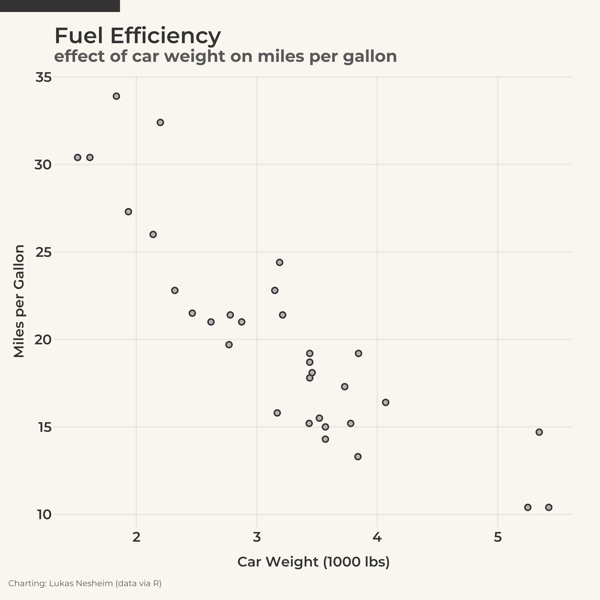
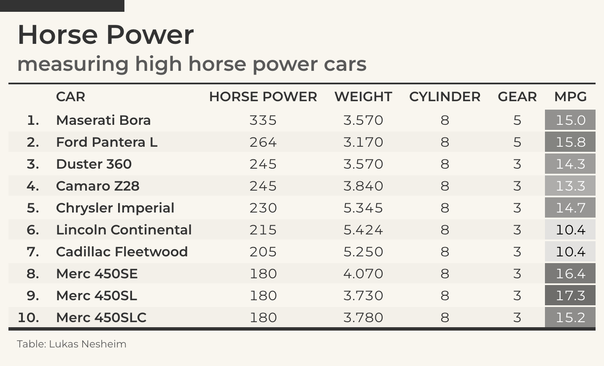

# baseliner

## Description
The `baseliner` package defines the styles and colors for the Baseline brand and is used to apply this as a theme to `ggplot2` plots and `gt` tables. The themes provide consistent styling for figures across a wide variety of domains, including (but not limited to) economics, policy, and sports analytics. Thanks to Andrew Weatherman, author of the `gtUtils` package, for the table theme inspiration in particular.

## Installation
Installation requires the `remotes` package and a personal access token (PAT).

1. Open an `R` terminal window.
2. Run the command `install.packages("remotes")` to install the `remotes` package.
3. Generate a PAT on GitHub with at least the "repo" scope.
4. Install via GitHub by running the following command and replacing `PAT` with your own personal access token:

```
remotes::install_github("lukasnesheim/baseliner", auth_token = "PAT")
```

## Getting Started
`baseliner` is straightforward and easy to use. The package enables styling of either a `ggplot` plot object or a `gt` table object through the following function calls:

`add_logo_gg()`  
Add the Baseline logo to a `ggplot` plot object.

`theme_baseline_gg()`  
Style a `ggplot` plot object with the Baseline theme.

`add_logo_gt()`  
Add the Baseline logo to a `gt` table object.

`theme_baseline_gt()`  
Style a `gt` table object with the Baseline theme.

## Usage Examples

### Plot Styling
The following is a quick plot example with the built-in `mtcars` dataset. The code below styles the plot with the Baseline theme and adds the Baseline logo:

```R
plot <- ggplot(
  mtcars,
  aes(x = wt, y = mpg)
) +
  geom_point(
    aes(fill = "#B3B3B3", color = "#333333"),
    shape = 21,
    size = 1.5,
    stroke = 0.75
  ) +
  scale_fill_identity() +
  scale_color_identity() +
  labs(
    title = "Fuel Efficiency",
    subtitle = "the effect of car weight on miles per gallon",
    caption = "Charting: Lukas Nesheim (data via R)",
    x = "Car Weight",
    y = "Miles per Gallon"
  ) +
  theme_baseline_gg()

plot <- add_logo_gg(plot)
```



### Table Styling
The following is a quick table example with the built-in `mtcars` dataset. First, wrangle the data to give us a tibble with the top 10 cars by horse power:

```R
data <- mtcars %>%
  as_tibble(rownames = "car") %>%
  arrange(desc(hp)) %>%
  slice(1:10) %>%
  transmute(rank = paste0(1:10, "."), car, hp, wt, cyl, gear, mpg)
```

Next, the code below styles the table with the Baseline theme but does not yet add the logo:

```R
table <- data %>%
  gt() %>%
  tab_header(
    title = "Horse Power",
    subtitle = "measuring high horse power cars"
  ) %>%
  cols_label(
    "rank" ~ "",
    "car" ~ "CAR",
    "hp" ~ "HORSE POWER",
    "wt" ~ "WEIGHT",
    "cyl" ~ "CYLINDER",
    "gear" ~ "GEAR",
    "mpg" ~ "MPG"
  ) %>%
  tab_source_note(
    source_note = "Table: Lukas Nesheim"
  ) %>%
  theme_baseline_gt() %>%
  tab_style(
    locations = gt::cells_body(columns = hp:mpg),
    style = gt::cell_text(align = "center")
  ) %>%
  tab_style(
    locations = gt::cells_column_labels(columns = car),
    style = gt::cell_text(align = "left")
  ) %>%
  tab_style(
    locations = gt::cells_body(columns = rank:car),
    style = gt::cell_text(weight = style$table$font$weight$label)
  ) %>%
  data_color(
    columns = "mpg",
    fn = scales::col_numeric(
      domain = c(10.4, 17.3),
      palette = c(color$london[[6]], color$london[[3]])
    ),
    alpha = 0.7
  ) %>%
  gtUtils::gt_save_crop(
    file = paste0("test_table.png"),
    bg = color$background,
    whitespace = 20,
    zoom = 4
  )
```

Finally, the following code adds the Baseline logo and re-saves the table image:

```R
table_image <- magick::image_read("test_table.png")
final_image <- add_logo_gt(table_image, width = 1180, height = 1400)

magick::image_write(final_image, "test_table.png", format = "png")
```


